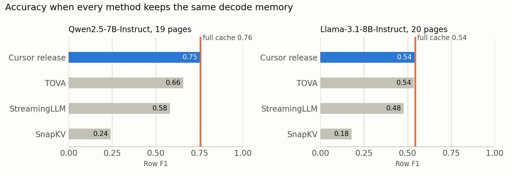
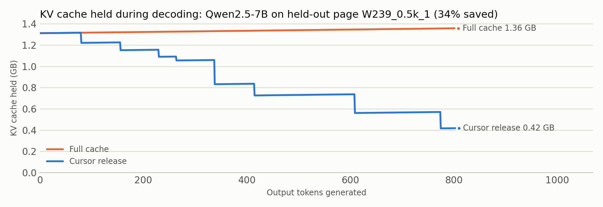

# Progress-aware KV cache release

When a language model copies a long table out of a long web page in page order, this code frees the memory the
model holds for the parts of the page it has already copied. It is like copying a table out of a long page: you
can stop holding onto the parts you have already copied.

- **KV cache**: the memory a model keeps for every token it has read, so it does not reread them for each new word.
- **Decoding**: generating the answer one token at a time; the cache must stay in memory the whole time.

<picture>
  <source media="(prefers-color-scheme: dark)" srcset="figures/accuracy-dark.png">
  
</picture>

<picture>
  <source media="(prefers-color-scheme: dark)" srcset="figures/memory-dark.png">
  
</picture>

## Results

LongProc HTML-to-TSV, a benchmark where a model turns a 6K to 26K-token web page into a table. Held-out pages
where cursor release freed memory; every method holds the same decode memory at each step (38% less than full cache
on Qwen, 36% on Llama). Scores are row F1 from LongProc's official evaluator (1.0 means every row is exactly
right); changes are against full cache with 95% intervals that resample whole websites.

| Method | Qwen2.5-7B-Instruct (19 pages) | Llama-3.1-8B-Instruct (20 pages) |
|---|---|---|
| Full cache (nothing freed) | 0.757 | 0.544 |
| Cursor release (this repo) | 0.755 (−0.3 [−0.9, 0.0]) | 0.540 (−0.4 [−1.2, 0.0]) |
| TOVA, per layer | 0.658 (−9.9 [−17.5, −3.4]) | 0.537 (−0.8 [−1.8, 0.0]) |
| StreamingLLM-style | 0.582 (−17.6 [−29.5, −7.6]) | 0.478 (−6.6 [−22.4, +10.4]) |
| SnapKV, per head | 0.241 (−51.6 [−69.6, −33.5]) | 0.179 (−36.5 [−56.2, −17.0]) |

On all 31 paired held-out Qwen pages, including those where nothing is freed, cursor release saves 27.4% of
decode KV memory [18.3, 36.1] at −0.2 points of row F1. On long tables (8K tier, 9 pages, about 2,800 output tokens)
it saves 30.4% but loses 7.5 points [−20.4, −0.3], mostly on one page whose delimiters drifted after an eviction. TOVA evicts what the model attends to least;
StreamingLLM-style drops the oldest page text; SnapKV keeps what the prompt's final instructions attend to.

## How it works

- The model reads the whole page once, as usual. The page's cache is split into blocks of 128 tokens.
- Each time the model finishes a table row, the row's cells are string-matched back into the page to find where
  the model is reading. No attention scores and no trained predictor are used.
- Every page block more than about 1,150 tokens (9 blocks) behind the last matched row is removed from the cache.
- Removed rows are physically copied out of the cache tensors; the kept tokens keep their original positions, so
  the model's view of the text it still needs is unchanged.

## Limitations

- It saves memory during decoding, not peak memory: the whole page is still read at the start.
- It runs at batch size 1 in plain Hugging Face Transformers, with no serving engine.
- It needs output that follows the document's order; unordered fields gain nothing.
- On Llama-3.1-8B it ties TOVA; it is clearly ahead only on Qwen2.5-7B.
